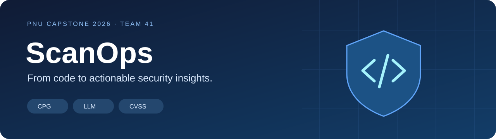
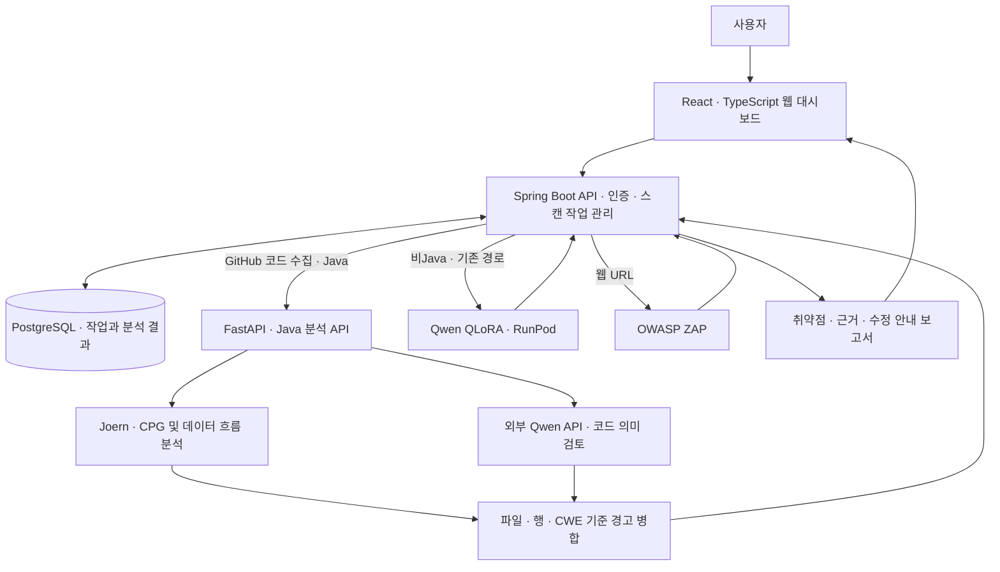
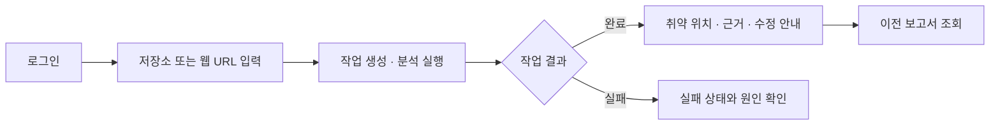
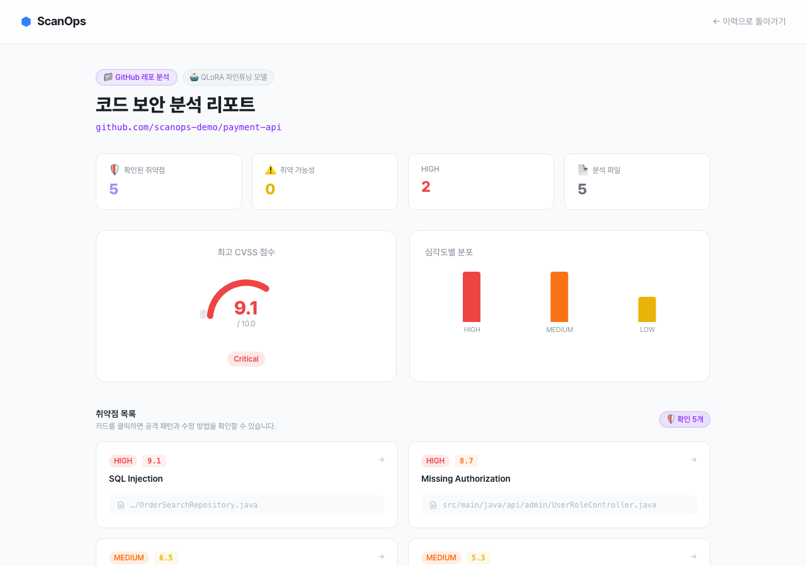

<div align="center">



### CPG·대규모 언어모델 및 CVSS 기반<br/>Java 코드·웹 애플리케이션 취약점 진단 및 리포팅 시스템

**코드와 웹 서비스를 분석하고, 취약 위치와 검토 근거를 하나의 보고서로 연결합니다.**

[소개 영상](https://www.youtube.com/watch?v=l9asE8BM99E) · [최종보고서](docs/01.보고서/03.최종보고서.pdf) · [발표자료](docs/03.발표자료/발표자료.pdf) · [포스터](docs/02.포스터/포스터파일.pdf)

부산대학교 정보컴퓨터공학부 · 2026 전기 졸업과제 · **41팀 이세혜**

</div>

---

[1. 프로젝트 소개](#1-프로젝트-소개) · [2. 상세설계](#2-상세설계) · [3. 설치 및 사용 방법](#3-설치-및-사용-방법) · [4. 소개 및 시연 영상](#4-소개-및-시연-영상) · [5. 팀 소개](#5-팀-소개) · [6. 개발 결과](#6-개발-결과) · [7. 제출 자료](#7-제출-자료) · [8. 참고 자료](#8-참고-자료)

## 1. 프로젝트 소개

### 1.1. 배경 및 필요성

개발 속도가 빨라질수록 코드와 배포된 웹 서비스의 보안 문제를 지속적으로 확인하는 일이 중요해집니다. 정적 분석은 코드의 구조와 데이터 흐름을 추적할 수 있지만 탐지 규칙이 다루지 못하는 API에서는 경고를 놓칠 수 있습니다. LLM은 코드의 의미를 검토할 수 있지만 응답의 위치·근거·형식을 검사하고 실제 코드와 연결하는 과정이 필요합니다.

**ScanOps는 GitHub 저장소와 웹 URL을 입력받아 분석 작업을 실행하고, 파일·행·CWE·분석 근거와 수정 안내를 웹 보고서로 제공합니다.** 개발자는 스캔 요청부터 진행 상태, 취약점 검토, 이전 보고서 조회까지 하나의 흐름으로 사용할 수 있습니다.

### 1.2. 목표 및 주요 내용

| 기능 | 입력 | 처리 및 결과 |
| :--- | :--- | :--- |
| **저장소 분석** | GitHub 저장소 | 백엔드가 코드를 수집하고 언어에 맞는 분석 서버로 전달 |
| **Java CPG + LLM 분석** | Java 파일 묶음 | Joern 구조·데이터 흐름 경고와 Qwen 의미 검토 경고를 병합 |
| **웹 동적 분석** | 웹 URL | OWASP ZAP 분석 결과를 수집·저장 |
| **취약점 보고서** | 완료된 스캔 | 취약 위치·CWE·위험도·근거·수정 안내와 탐지 출처 표시 |
| **작업 관리** | 스캔 요청·작업 ID | 인증, 진행·완료·실패 상태 관리, 결과 저장·재조회 |

### 1.3. 구현의 특징과 기대효과

- **근거를 남기는 결과:** 경고의 파일·행과 CPG/LLM 탐지 출처를 보존해 개발자가 검토할 위치를 찾도록 돕습니다.
- **분석 실패의 구분:** 불완전한 응답이나 누락 파일을 정상적인 ‘취약점 없음’으로 처리하지 않습니다.
- **분석부터 리포트까지 연결:** 별도 분석 도구의 실행 결과를 스캔 상태·DB·화면과 연결합니다.
- **규칙 보강 효과의 검증:** LLM이 제안한 source/sink 규칙을 검사하고 CPG에 추가했을 때 탐지와 오탐이 어떻게 변하는지 별도 실험으로 비교했습니다.

공개 코드와 실행 문서는 보안 분석 과정을 학습하고 재검토하는 데 활용할 수 있습니다. 향후 과제는 오탐 감소, 실제 프로젝트 대상 독립 평가, 대형 저장소 처리 검증입니다.

## 2. 상세설계

### 2.1. 시스템 구성도



현재 Java 서비스는 **고정 CPG 경고와 Qwen 의미 검토 경고의 합집합**을 사용합니다. 배포 Compose에서 동적 규칙 생성은 꺼져 있으며, 아래 6절의 규칙 보강 실험과는 별도 구성입니다. Java 분석은 외부 Qwen API를 호출하므로 소스가 항상 로컬 환경에만 머무르는 구조는 아닙니다.

### 2.2. 사용 기술

| 영역 | 기술 | 구현 위치 |
| :--- | :--- | :--- |
| Frontend | React 19 · TypeScript 6 · Vite 8 · React Router · Recharts | [scanops-frontend](scanops-frontend) |
| Backend | Java 17 · Spring Boot 3.2.5 · Spring Security · JPA · Flyway | [scanops-backend](scanops-backend) |
| Java 분석 | Python · FastAPI · Joern CPG · Qwen3.8-Max API | [scanops-model](scanops-model) |
| 기존 비Java 분석 | Qwen3.5-9B · QLoRA · RunPod | [모델 카드](scanops-model/docs/FINETUNED_MODEL.md) |
| DB · Infrastructure | PostgreSQL 15 · Docker Compose · AWS · OWASP ZAP | [scanops-infra](scanops-infra) |

의존성의 정확한 버전은 각 모듈의 lockfile·빌드 파일·Dockerfile을 기준으로 합니다. Joern·Qwen·ZAP은 외부 도구이며, 팀은 이 도구들의 연결, 결과 검증·병합, 평가 절차와 서비스 기능을 구현했습니다.

### 2.3. 디렉토리 구조

```text
capstone-2026-team-41/
├── README.md                 # 작품 소개와 제출 자료 안내
├── install_and_build.sh      # 프론트·백엔드 빌드 도우미
├── scanops-frontend/          # 웹 대시보드와 API 연결
├── scanops-backend/           # 인증·스캔·저장·리포트 API
├── scanops-model/             # CPG·LLM 엔진, 실험 및 기존 학습 코드
├── scanops-infra/             # Docker 구성과 배포 안내
└── docs/
    ├── 01.보고서/             # 중간·최종보고서
    ├── 02.포스터/             # 졸업과제 포스터
    ├── 03.발표자료/           # 발표 PDF·PPTX
    ├── assets/               # README 이미지
    ├── migration/            # 원본 커밋·파일·이력 보존 기록
    └── template/             # 학교 제공 원본 안내
```

4개 원본 저장소의 `main` 파일을 동일한 이름의 폴더에 그대로 담았습니다. 모듈 간 상대 경로도 유지됩니다. 원본의 개발 브랜치·태그는 [이력 보존 안내](docs/migration/README.md), 이전 모델 가중치는 [제출 저장소 릴리스](https://github.com/pnucse-capstone2026/capstone-2026-team-41/releases)에서 확인할 수 있습니다.

## 3. 설치 및 사용 방법

### 3.1. 준비 환경

- **Frontend:** Node.js 22.12 이상인 22.x 또는 지원되는 상위 버전, npm
- **Backend:** JDK 17, PostgreSQL — Gradle Wrapper 포함
- **Java 분석 서버:** x86-64 Docker 호스트, Docker Compose, DashScope API 키
- **메모리:** Java Compose 기준 Joern 5 GiB + API 1.5 GiB 외에 OS 여유 공간 필요

```bash
git clone https://github.com/pnucse-capstone2026/capstone-2026-team-41.git
cd capstone-2026-team-41
```

각 모듈을 별도로 clone할 필요 없이 아래 절차를 진행합니다.

### 3.2. Java 분석 서버

```bash
cd scanops-infra
cp .env.java.example .env.java
```

`.env.java`의 `SCANOPS_API_KEY`, `DASHSCOPE_API_KEY`, `DASHSCOPE_BASE_URL`, `JAVA_ENGINE_BIND_IP`를 실제 환경에 맞게 입력합니다. 로컬 호스트에서만 호출한다면 바인딩 주소는 `127.0.0.1`, 분리된 서버라면 백엔드에서 접근 가능한 private IP를 사용합니다. `GRAPH_SPEC_DYNAMIC_RULE_MODE=shadow`를 유지합니다.

```bash
docker compose -p scanops-java -f docker-compose.java-engine.yml --env-file .env.java config --quiet
docker compose -p scanops-java -f docker-compose.java-engine.yml --env-file .env.java up -d --build
```

Java API 포트는 **8100**, Joern worker **8200**은 컨테이너 내부 통신용입니다. 상세 설정은 [Java 배포 안내](scanops-infra/docs/JAVA_DEPLOYMENT.md)를 참고합니다.

### 3.3. DB와 백엔드

저장소 루트에서 로컬 개발 DB를 실행합니다.

```bash
cd scanops-infra
docker compose up -d postgres
cd ../scanops-backend
```

[백엔드 설정 안내](scanops-backend/README.md#4-실행-환경과-설정)에 따라 DB·JWT·OAuth·CORS·모델 설정을 **실행 프로세스의 환경변수로 전달**한 뒤 실행합니다. `.env`를 복사하는 것만으로 Spring에 주입되지는 않습니다.

| 설정 | 로컬 예시 또는 의미 |
| :--- | :--- |
| `JDBC_DATABASE_URL` | `jdbc:postgresql://localhost:5433/scanops` |
| `JDBC_DATABASE_USERNAME`, `JDBC_DATABASE_PASSWORD` | 로컬 Compose 기본값 각각 `scanops` |
| `JWT_SECRET` | 직접 생성한 충분히 긴 서명 키 |
| `GITHUB_OAUTH_CLIENT_ID`, `GITHUB_OAUTH_CLIENT_SECRET` | GitHub OAuth App 설정 |
| `GITHUB_OAUTH_REDIRECT_URI` | `http://localhost:8080/login/oauth2/code/github` |
| `FRONTEND_URL`, `CORS_ALLOWED_ORIGINS` | 실제 프론트 개발 주소 |
| `SCANOPS_JAVA_MODEL_URL` | `http://127.0.0.1:8100` 또는 분석 서버 private 주소 |
| `SCANOPS_JAVA_API_KEY` | Java 서버의 `SCANOPS_API_KEY`와 동일한 값 |

```bash
./gradlew bootRun
```

기본 백엔드 포트는 **8080**입니다. `PGUSER`·`PGPASSWORD`가 설정돼 있으면 DB 사용자·암호에 우선 적용됩니다. 웹 스캔과 기존 비Java 스캔은 각각 ZAP 및 기존 모델 서버를 추가로 연결해야 합니다.

### 3.4. 프론트엔드

별도 터미널에서 실행합니다.

```bash
cd scanops-frontend
npm ci
cp .env.example .env.local
```

`.env.local`의 `VITE_API_BASE_URL`을 `http://localhost:8080`으로 설정합니다.

```bash
npm run dev
```

터미널에 표시되는 주소로 접속하고 **로그인 → 스캔 대상 입력 → 진행 상태 → 보고서 확인** 순서로 사용합니다. 개발 주소와 백엔드 CORS 설정을 맞추고, `VITE_` 변수에는 비밀키를 넣지 않습니다.

### 3.5. 빌드 및 문제 해결

저장소 루트의 도우미는 선택한 모듈만 설치·빌드합니다.

```bash
./install_and_build.sh frontend  # npm ci + TypeScript/Vite 빌드
./install_and_build.sh backend   # Gradle bootJar
```

| 현상 | 확인할 사항 |
| :--- | :--- |
| 로그인·API 연결 실패 | 백엔드 기동, 프론트 API 주소, OAuth·CORS 설정 |
| Java 요청이 기존 모델로 전달됨 | 백엔드의 Java 전용 URL·키 주입 여부 |
| 분석 API 401 | Java 공유키 일치 여부 |
| 413 / 429 | 입력 크기 제한 / 동시 분석 제한 |
| `PARTIAL` 또는 분석 오류 | Joern worker 상태, DashScope 설정과 로그 |

`/health` 성공과 실제 분석 성공은 구분합니다. 회귀 테스트 명령과 과거 검증 범위는 [검증 기록](scanops-model/docs/VERIFICATION.md), [모델 실행 안내](scanops-model/README.md)에 정리되어 있습니다.

## 4. 소개 및 시연 영상

<div align="center">

[](https://www.youtube.com/watch?v=l9asE8BM99E)

**[▶ ScanOps 소개 및 시연 영상 보기](https://www.youtube.com/watch?v=l9asE8BM99E)**

[부산대학교 정보컴퓨터공학부 YouTube 채널](https://www.youtube.com/channel/UCl6NSPKixz2Jdt1F5SwdVOQ)

</div>

영상과 함께 [발표자료 PDF](docs/03.발표자료/발표자료.pdf), [발표 원본 PPTX](docs/03.발표자료/발표자료.pptx)를 확인할 수 있습니다.

## 5. 팀 소개

**41팀 · 이세혜** — 부산대학교 정보컴퓨터공학부
지도교수: **손준영 교수**

| 이름 | 담당 | 주요 구현 | 연락처 |
| :--- | :--- | :--- | :--- |
| **김세한** | 프론트엔드 · CPG/LLM 탐지 엔진 | 웹 화면·스캔 UX, Java 경로 분리, Qwen 규칙 생성·검증, Juliet 비교평가 | [sehankim@pusan.ac.kr](mailto:sehankim@pusan.ac.kr) |
| **이경윤** | CPG/LLM 탐지 엔진 | Joern 실행환경, CPG·taint 질의, 데이터 흐름·후보 추출 실험, 엔진 안정화 | [kylee0293@gmail.com](mailto:kylee0293@gmail.com) |
| **전혜은** | 백엔드 · 인프라 | Spring Boot API, 인증·DB, 스캔 오케스트레이션, AWS/Docker·ZAP 연동 | [silver807@pusan.ac.kr](mailto:silver807@pusan.ac.kr) |

역할은 최종보고서의 구성원별 구현 범위를 기준으로 정리했습니다. 탐지 엔진과 서비스 연결은 공동으로 개발·검증했습니다.

## 6. 개발 결과

### 6.1. 사용자 흐름과 화면



<details>
<summary><b>보고서 화면 예시 보기</b></summary>



원본 저장소에 보존된 UI 예시입니다. 화면의 예시 수치와 과거 모델 표시는 현재 Java 엔진의 실측 성능을 뜻하지 않습니다.

</details>

2026년 9월 8일 Java 2파일의 사이트 시연에서 취약 파일의 원본 12행 CWE-79 경고와 안전 파일의 무경고, 작업 완료·DB 저장·화면 표시를 확인했습니다. 당시 기록은 [배포 검증 문서](scanops-infra/JAVA_CPG_DEPLOYMENT_20260908.md)에 있습니다.

### 6.2. 규칙 보강 평가

**NIST Juliet Java 38 CWE · 개발 190쌍 · 평가 534쌍(1,068판정)** 조건에서 비교했습니다.

| 방식 | TP | FP | FN | TN | F1 |
| :--- | ---: | ---: | ---: | ---: | ---: |
| 고정 CPG | 144 | 42 | 390 | 492 | 0.400 |
| 고정 CPG + LLM 생성 규칙 | **183** | 69 | 351 | 465 | **0.466** |

규칙 보강으로 **추가 취약 판정 39건**을 탐지했지만 **오탐도 27건** 증가했습니다. 이는 선택한 실험 조건에서 탐지 범위가 넓어졌다는 결과이며, 실제 배포 서비스의 정확도나 모든 지표의 개선을 뜻하지 않습니다. 비교군과 평가 한계는 [최종보고서](docs/01.보고서/03.최종보고서.pdf)와 [모델 README](scanops-model/README.md#6-평가-결과와-확인-범위)를 참고합니다.

전체 최종 평가 스크립트·manifest·원본 결과 묶음은 원본 `main`에 모두 포함되어 있지 않습니다. 이 저장소도 원본에 공개된 파일을 보존하므로 clone만으로 전체 평가가 재현되는 것은 아닙니다.

### 6.3. 멘토링 의견과 반영

| 의견 | 반영 내용 |
| :--- | :--- |
| 기술 용어·평가 과정 설명 보완 | CPG·source/sink·taint 정의와 표본 분할·채점 방법 명시 |
| AI 개발 단계와 최종 구조 구분 | 과거 QLoRA 경로, 현재 Java CPG+Qwen 서비스, 규칙 보강 실험 분리 |
| 평균 성능 외 원인 분석 필요 | TP·FP 변화, 탐지 범위와 오탐 증가를 함께 제시 |
| 요구조건과 구현 결과 연결 | 코드 설명, 서비스 연결, 확인된 결과와 미검증 범위 정리 |

최종보고서에 기록된 산학협력 자문의견과 대응 내용을 요약했습니다. 대형 저장소 부하·실제 CVE 일반화·실제 PR 전체 완료 경로는 추가 검증 과제입니다.

## 7. 제출 자료

| 자료 | 바로가기 |
| :--- | :--- |
| 최종보고서 | [PDF](docs/01.보고서/03.최종보고서.pdf) |
| 중간보고서 | [PDF](docs/01.보고서/02.중간보고서.pdf) |
| 졸업과제 포스터 | [PDF](docs/02.포스터/포스터파일.pdf) |
| 발표자료 | [PDF](docs/03.발표자료/발표자료.pdf) · [PPTX](docs/03.발표자료/발표자료.pptx) |
| 소개 및 시연 영상 | [YouTube](https://www.youtube.com/watch?v=l9asE8BM99E) |
| 이전 모델 가중치 · 전체 개발 이력 | [Releases](https://github.com/pnucse-capstone2026/capstone-2026-team-41/releases) |
| 이전 범위·원본 커밋·파일 검증 | [이전 기록](docs/migration/README.md) |

## 8. 참고 자료

- [학교 제출 안내 / 2024 Template](https://github.com/pnucse-capstone-2024/Capstone2024-Template)
- [제출 저장소에 제공된 2026 안내](docs/template/README-2026.md)
- [Joern 공식 문서](https://docs.joern.io/) · [OWASP ZAP 공식 문서](https://www.zaproxy.org/docs/)
- [NIST Software Assurance Reference Dataset](https://samate.nist.gov/SARD/) · [FIRST CVSS](https://www.first.org/cvss/)
- [원본 개발 조직](https://github.com/26Graduation) · [현재 Java 엔진 설명](scanops-model/docs/CPG_LLM.md)

---

<div align="center"><sub>ScanOps · Pusan National University · Capstone 2026 · Team 41</sub></div>
