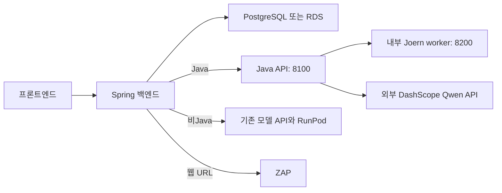

# ScanOps 인프라

백엔드·DB·분석 서버를 실행하고 연결하기 위한 **Docker 구성과 배포 안내**를 관리합니다. Java 분석 서버는 Joern CPG와 외부 Qwen API를 사용하며, 기존 비Java 모델·웹 분석 경로와 구분합니다.

## 1. 담당 역할과 구현 내용

개발팀은 서비스별 컨테이너 구성, Java 전용 분석 호스트 분리, 환경변수·네트워크 연결, 상태 확인·배포 절차를 정리했습니다. Docker, PostgreSQL, OWASP ZAP 등 외부 도구를 활용하며 이 저장소 자체가 취약점을 판정하지는 않습니다.

| 구성 | 역할 |
|---|---|
| 프론트엔드 | 사용자 입력·진행·리포트 표시 |
| Spring 백엔드 | 인증·작업 관리·분석 라우팅·결과 저장 |
| PostgreSQL / 배포 시 RDS | 서비스 데이터 저장 |
| Java 분석 호스트 | FastAPI + Joern worker, 외부 DashScope Qwen 호출 |
| 기존 모델 API / RunPod | 비Java QLoRA 경로 |
| ZAP 호스트 | 웹 URL 동적 분석 |

## 2. 연결 구조



Java 8100은 백엔드에서 접근할 분석 호스트의 private 인터페이스에 바인딩하고, Joern 8200은 컨테이너 내부 연결에 사용합니다. 배포 구성의 `shadow`는 동적 규칙을 판정에 적용하지 않는다는 뜻이며 별도의 Qwen 의미 검토는 실행됩니다.

## 3. 주요 파일과 적용 범위

| 파일 | 담당 범위 |
|---|---|
| [docker-compose.java-engine.yml](docker-compose.java-engine.yml) | Java API·Joern worker 빌드, 내부 연결, 메모리·입력 제한, 상태 확인 |
| [.env.java.example](.env.java.example) | Java 분석 서버에 필요한 설정 항목 |
| [docs/JAVA_DEPLOYMENT.md](docs/JAVA_DEPLOYMENT.md) | 현재 Java 기동·백엔드 연결 절차 |
| [docker-compose.rebuild.yml](docker-compose.rebuild.yml) | 기존 백엔드·모델 서버·DB 구성. Java 전용 변수는 별도 전달 필요 |
| [docker-compose.yml](docker-compose.yml) | 로컬 PostgreSQL·ZAP·DVWA 실습 구성. Java 엔진이나 백엔드를 함께 실행하지 않음 |
| [JAVA_CPG_DEPLOYMENT_20260908.md](JAVA_CPG_DEPLOYMENT_20260908.md) | 9월 8일 배포·연동 결과와 당시 제약 |

여러 Compose 파일은 대체·보존 구성을 포함합니다. 전부 동시에 실행하는 방식이 아니며 목적에 맞는 파일을 명시합니다.

## 4. Java 분석 서버 실행

x86-64 Docker 호스트와 Docker Compose를 준비합니다. 시작 설정상 Joern 5GiB, API 1536MiB 외에 OS 여유 메모리가 필요합니다. 이는 동시 처리 용량을 보장하는 값은 아닙니다.

```sh
git clone https://github.com/26Graduation/scanops-model.git
git clone https://github.com/26Graduation/scanops-infra.git
cd scanops-infra
cp .env.java.example .env.java
```

두 저장소를 같은 부모 디렉터리에 두어야 상대 빌드 경로 `../scanops-model`이 맞습니다. `.env.java`를 다음 기준으로 채웁니다.

| 변수 | 설정 |
|---|---|
| `SCANOPS_API_KEY` | 백엔드와 Java 분석 API 사이 공유키 |
| `DASHSCOPE_API_KEY` | Qwen 호출 키 |
| `DASHSCOPE_BASE_URL` | 사용할 DashScope compatible-mode 주소 |
| `JAVA_ENGINE_BIND_IP` | 분석 호스트의 실제 private IP |
| `GRAPH_SPEC_DYNAMIC_RULE_MODE` | 현재 배포 기준 `shadow` |

```sh
docker compose -p scanops-java -f docker-compose.java-engine.yml --env-file .env.java config --quiet
docker compose -p scanops-java -f docker-compose.java-engine.yml --env-file .env.java up -d --build
docker compose -p scanops-java -f docker-compose.java-engine.yml --env-file .env.java ps
```

현재 Compose는 규칙 생성·critic·동적 sanitizer/propagation을 끄고 고정 CPG + Qwen 의미 검토를 사용합니다.

## 5. 백엔드·프론트 연결

백엔드에는 아래 두 변수를 전달합니다.

```dotenv
SCANOPS_JAVA_MODEL_URL=http://<analysis-private-ip>:8100
SCANOPS_JAVA_API_KEY=<same-value-as-java-SCANOPS_API_KEY>
```

기존 `SCANOPS_MODEL_URL`과 `SCANOPS_API_KEY`는 비Java 경로용입니다. Java URL이 비어 있으면 기존 모델 경로를 유지합니다.

`docker-compose.rebuild.yml`을 사용하는 경우 환경 파일에 변수만 추가하면 백엔드 컨테이너로 전달되지 않습니다. 별도 override 파일을 만들어 기존 backend 서비스에 주입할 수 있습니다.

```yaml
# compose.java-route.yml
services:
  backend:
    environment:
      SCANOPS_JAVA_MODEL_URL: ${SCANOPS_JAVA_MODEL_URL:?Set Java model URL}
      SCANOPS_JAVA_API_KEY: ${SCANOPS_JAVA_API_KEY:?Set Java shared key}
```

기존 서비스 설정을 준비한 뒤 아래와 같이 구성만 먼저 검사합니다. 기존 DB·모델·ZAP·OAuth 설정까지 필요하므로 `.env.aws`는 기존 배포 안내와 각 서비스 설정을 확인해 작성합니다.

```sh
docker compose -f docker-compose.rebuild.yml -f compose.java-route.yml --env-file .env.aws config --quiet
```

운영 RDS 사용 환경에서는 기존 DB 연결 override도 함께 유지해야 합니다. 위 기본 Compose는 자체 PostgreSQL을 가리키므로 운영 구성에 그대로 대체 적용하지 않습니다. 백엔드의 DB·OAuth·CORS는 [백엔드 안내](https://github.com/26Graduation/scanops-backend#readme), 프론트의 `VITE_API_BASE_URL`은 [프론트 안내](https://github.com/26Graduation/scanops-frontend#readme)에 따라 설정합니다.

## 6. 상태·로그·실행 결과 확인

```sh
docker compose -p scanops-java -f docker-compose.java-engine.yml --env-file .env.java ps
docker compose -p scanops-java -f docker-compose.java-engine.yml --env-file .env.java logs --tail=100 model-api joern-worker
```

백엔드 호스트에서 Java API의 `/health`를 확인한 뒤 인증 헤더를 넣은 `/analyze/batch`로 실제 연결을 확인합니다. [입력 예시](https://github.com/26Graduation/scanops-model#readme)를 참고하세요. health 응답만으로 Joern·Qwen 분석 성공을 판단하지 않습니다.

| 현상 | 확인할 사항 |
|---|---|
| Java가 이전 모델로 전달됨 | Java URL·키가 실제 백엔드 프로세스/컨테이너에 주입됐는지 |
| 401 | 백엔드 Java 키와 분석 API 공유키 일치 여부 |
| 413 | 최대 50파일·파일당 200000자·전체 500000자 제한 |
| 429 | 동시 분석 1개 제한과 진행 중 작업 |
| PARTIAL·분석 오류 | Joern 상태, DashScope 설정, 단계별 로그 |

단계별 timeout은 저장소 전체의 종료시한과 같지 않습니다. API 키·개인키를 포함한 설정 파일은 공개 저장소에 올리지 않습니다.

로컬 백엔드 개발용 DB만 실행하려면 인프라 저장소에서 다음 명령을 사용합니다.

```sh
docker compose up -d postgres
```

기본 DB 접속은 `localhost:5433`이며 `docker-compose.yml`의 기본 계정은 로컬 개발용입니다. ZAP·DVWA 실습은 해당 Compose를 따로 확인합니다.

## 7. 확인된 범위와 관련 자료

2026-09-08 Java 2파일의 분석·DB 저장·사이트 표시가 확인됐습니다. 9월 14일에는 main 구성의 Compose 검사를 수행했으며 서버를 재배포하지 않았습니다. 이번 README 수정도 서버 재배포와 별개입니다. 대형 저장소 부하와 실제 PR 전체 완료 경로에는 추가 검증이 필요합니다.

- [분석 엔진](https://github.com/26Graduation/scanops-model): 코드·API·평가 설명
- [백엔드](https://github.com/26Graduation/scanops-backend): 인증·라우팅·저장
- [프론트엔드](https://github.com/26Graduation/scanops-frontend): 화면·백엔드 연결
- [현재 Java 실행 안내](docs/JAVA_DEPLOYMENT.md)
- [이전 온프레미스 안내](README_onprem.md), [과거 README](docs/history/README-before-20260914.md): 당시 구성 기록
