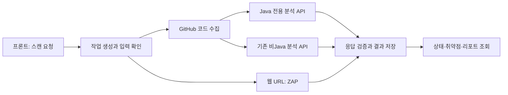

# ScanOps 백엔드

사용자의 스캔 요청을 받아 분석 서버를 호출하고 **작업 상태·취약점·리포트를 저장하고 제공하는 Spring Boot 서버**입니다. Java 17, Spring Boot 3.2.5, PostgreSQL, JPA, Flyway를 사용합니다.

## 1. 담당 역할과 구현 내용

개발팀은 인증, 스캔 작업 관리, 분석 서버 연결, 결과 저장·조회, GitHub 연동과 취약점 리포트 처리를 구현했습니다. 실제 CPG·LLM 탐지는 모델 서버, 웹 동적 분석은 OWASP ZAP이 수행합니다.

| 입력 | 연결할 분석 경로 |
|---|---|
| Java / Java Spring Boot | Java 전용 API → Joern CPG + Qwen3.8-Max |
| 비Java 코드 | 기존 모델 API → Qwen3.5-9B QLoRA 경로 |
| 웹 URL | OWASP ZAP 동적 분석 |

그 밖에 팀·사용량·구독·설문 기능이 있으며 각각 `team/`, `token/`, `subscription/`, `survey/`에 있습니다.

## 2. 동작 흐름



작업 상태는 `PENDING → RUNNING → COMPLETED`이며 실패는 `FAILED`로 처리합니다. Java 분석의 `PARTIAL`, 파일 누락·불일치를 정상적인 ‘취약점 없음’으로 저장하지 않습니다. 모델이 반환한 복수 경고와 원본 위치·출처를 전달합니다.

## 3. 주요 코드와 데이터

아래 Java 경로는 `src/main/java/com/scanops/` 기준입니다.

| 파일 | 역할 |
|---|---|
| [scan/ScanController.java](src/main/java/com/scanops/scan/ScanController.java) | 스캔 생성·조회·목록·삭제 API 진입점 |
| [scan/GithubPipelineRunner.java](src/main/java/com/scanops/scan/GithubPipelineRunner.java), [GithubScanService.java](src/main/java/com/scanops/scan/GithubScanService.java) | 저장소 분석 작업과 파일 수집·모델 호출·결과 처리를 연결 |
| [scan/ScanopsModelClient.java](src/main/java/com/scanops/scan/ScanopsModelClient.java) | `routesToJava()`로 경로 선택, `analyzeBatch()`로 분석 호출·응답 검사, `individualResults()`로 경고 전달 |
| [scan/ScanPipelineRunner.java](src/main/java/com/scanops/scan/ScanPipelineRunner.java), [ZapClient.java](src/main/java/com/scanops/scan/ZapClient.java) | 웹 URL 분석 흐름과 ZAP API 연결 |
| [report/ReportService.java](src/main/java/com/scanops/report/ReportService.java) | 저장된 분석 결과를 보고서 응답으로 구성 |
| [vulnerability/CvssCalculator.java](src/main/java/com/scanops/vulnerability/CvssCalculator.java) | CVSS 관련 계산 처리 |
| [auth/JwtService.java](src/main/java/com/scanops/auth/JwtService.java), [config/SecurityConfig.java](src/main/java/com/scanops/config/SecurityConfig.java) | JWT와 인증·접근 설정 |
| [scan/GitHubAppWebhookController.java](src/main/java/com/scanops/scan/GitHubAppWebhookController.java) | GitHub App 이벤트 수신 |
| [db/migration/](src/main/resources/db/migration) | Flyway DB 스키마 변경 이력 |

핵심 저장 대상은 사용자(`user/`), 스캔 작업(`scan/`), 취약점(`vulnerability/`)입니다. 스키마 생성·변경은 Flyway가 담당하고 Hibernate는 `validate`로 검증합니다. 실제 필드와 관계는 엔티티 및 마이그레이션 SQL을 기준으로 확인합니다.

## 4. 실행 환경과 설정

JDK 17, 프로젝트 Gradle Wrapper, PostgreSQL을 준비합니다. 설정 기준은 [application.yml](src/main/resources/application.yml)입니다. `.env.example`은 일부 초기 설정만 포함하며 파일 복사만으로 Spring 프로세스에 환경변수가 주입되지는 않습니다. IDE 실행 설정이나 셸 환경변수로 전달합니다.

| 환경변수 | 용도 |
|---|---|
| `JDBC_DATABASE_URL`, `JDBC_DATABASE_USERNAME`, `JDBC_DATABASE_PASSWORD` | PostgreSQL 연결. `PGUSER`·`PGPASSWORD`가 있으면 사용자·암호에 우선 적용 |
| `GITHUB_OAUTH_CLIENT_ID`, `GITHUB_OAUTH_CLIENT_SECRET` | GitHub OAuth 등록 및 로그인 설정 |
| `GITHUB_OAUTH_REDIRECT_URI` | 로컬에서는 `http://localhost:8080/login/oauth2/code/github`로 설정하고 OAuth App에도 등록 |
| `JWT_SECRET`, `FRONTEND_URL`, `CORS_ALLOWED_ORIGINS` | 세션 토큰 및 프론트 연결 |
| `SCANOPS_JAVA_MODEL_URL`, `SCANOPS_JAVA_API_KEY` | Java 분석 서버 URL 및 공유 인증키 |
| `SCANOPS_MODEL_URL`, `SCANOPS_API_KEY` | 기존 비Java 모델 URL 및 인증키 |
| `ZAP_HOST`, `ZAP_API_KEY` | 웹 분석 서버 연결 |
| `GITHUB_APP_ID`, `GITHUB_APP_PRIVATE_KEY`, `GITHUB_APP_SLUG`, `GITHUB_WEBHOOK_SECRET` | GitHub App·웹훅 기능 사용 시 설정 |

Java URL이 비어 있으면 기존 모델 경로를 사용하므로 **Java CPG+LLM을 연결하려면 Java 전용 두 변수를 모두 설정**합니다. API 키와 개인키는 README나 추적 파일에 넣지 않습니다.

로컬 DB만 필요한 경우 인프라 저장소에서 `docker compose up -d postgres`로 준비할 수 있습니다. 기본 접속은 `localhost:5433`, DB·사용자·암호는 `scanops`이며 로컬 개발용입니다.

설정을 주입한 뒤 백엔드 저장소에서 실행합니다.

```sh
./gradlew bootRun
```

메일·추가 AI 설명·GitHub App 등 기능별 변수는 `application.yml`에서 확인합니다. 전체 서버 연결은 [인프라 안내](https://github.com/26Graduation/scanops-infra/blob/main/docs/JAVA_DEPLOYMENT.md)를 따릅니다.

## 5. 주요 API와 결과 확인

| API | 용도 |
|---|---|
| `POST /api/auth/signup`, `POST /api/auth/login` | 가입·로그인 |
| `POST /api/scans` | 스캔 요청 |
| `GET /api/scans/{id}` | 진행 상태 조회 |
| `GET /api/scans/{id}/vulnerabilities` | 취약점 목록 |
| `GET /api/reports/{jobId}` | 보고서 조회 |
| `POST /api/github/pr-scan` | PR 분석 요청 |
| `GET /actuator/health` | 서버·의존 상태 확인 |

스캔 요청 본문 예시입니다. 인증·접근 권한·사용량 조건을 충족해야 실행됩니다.

```json
{
  "targetUrl": "https://github.com/OWNER/REPOSITORY",
  "ownerEmail": "developer@example.com",
  "scanMode": "GITHUB_REPO"
}
```

프론트에서 전달받은 작업 ID로 상태를 조회하고, 완료 후 취약점과 보고서를 확인합니다. 정확한 요청·응답 형식은 [ScanRequest](src/main/java/com/scanops/scan/ScanRequest.java)와 각 컨트롤러·DTO를 기준으로 합니다. 웹 스캔은 기본적으로 도메인 소유권 확인을 요구합니다.

## 6. 테스트와 확인 범위

```sh
./gradlew test
./gradlew bootJar
```

- [JavaModelRoutingTest](src/test/java/com/scanops/scan/JavaModelRoutingTest.java): 언어별 모델 경로
- [ModelEnsembleContractTest](src/test/java/com/scanops/scan/ModelEnsembleContractTest.java): 복수 경고·위치·불완전 응답 계약
- 테스트 결과: `build/reports/tests/test/index.html`

2026-09-14 main 통합 기록상 백엔드 테스트 40개가 통과했습니다. 2026-09-08 Java 2파일 사이트 시연에서는 작업 완료와 취약점 저장·표시를 확인했습니다. 이는 전체 저장소 정확도, 대규모 부하, 실제 PR 전체 경로의 검증을 뜻하지 않습니다. [검증 기록](https://github.com/26Graduation/scanops-model/blob/main/docs/VERIFICATION.md)을 함께 확인하세요.

## 7. 관련 저장소와 문서

- [분석 엔진](https://github.com/26Graduation/scanops-model): CPG·LLM 및 이전 모델
- [프론트엔드](https://github.com/26Graduation/scanops-frontend): 사용자 화면
- [인프라](https://github.com/26Graduation/scanops-infra): DB·분석 서버 실행
- [이전 README](docs/history/README-before-20260914.md): 과거 API·배포 구성 기록
