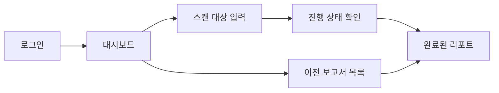

# ScanOps 프론트엔드

사용자가 **스캔을 요청하고 진행 상태와 취약점 리포트를 확인하는 웹 대시보드**입니다. React·TypeScript·Vite로 구현했으며 백엔드 API를 통해 분석 결과를 조회합니다.

## 1. 담당 역할과 구현 내용

개발팀은 로그인·스캔 입력·진행 상태·보고서 화면, API 연결, 인증이 필요한 화면의 접근 처리, 다국어 UI를 구현했습니다. 프론트는 분석 결과를 표시하며 실제 CPG·LLM 분석과 언어별 라우팅은 백엔드·모델 서버가 담당합니다.

- 저장소 또는 웹 URL 스캔 요청
- 작업 진행 상태와 실패 안내
- 취약 위치·위험도·분석 근거·수정 안내 확인
- 이전 보고서 목록과 대시보드
- GitHub 연동, 팀·계정 관리, 설문 등 부가 화면

## 2. 화면과 사용자 흐름



| 경로 | 화면과 역할 |
|---|---|
| `/`, `/login`, `/signup` | 서비스 소개·로그인·가입 |
| `/dashboard` | 대시보드 |
| `/scan` | 분석 대상 입력 |
| `/scan/:id/status` | 작업 진행·완료·실패 확인 |
| `/report/:id`, `/reports` | 개별 리포트와 목록 |
| `/integrations` | GitHub 연동 |
| `/team`, `/mypage`, `/settings`, `/survey` | 팀·계정·설정·설문 |

라우트와 인증 적용 여부는 [router.tsx](src/app/router.tsx)에 정의합니다. 요금제·결제 화면은 `VITE_ENABLE_PRICING` 설정에 따라 노출됩니다.

## 3. 주요 코드 설명

| 파일·폴더 | 역할 |
|---|---|
| [src/app/router.tsx](src/app/router.tsx), [ProtectedRoute.tsx](src/app/ProtectedRoute.tsx) | URL별 화면 연결과 로그인 확인 |
| [ScanPage.tsx](src/pages/scan/ui/ScanPage.tsx), [ScanForm.tsx](src/features/scan-request/ui/ScanForm.tsx) | 스캔 대상 입력과 요청 UI |
| [StatusPage.tsx](src/pages/scan-status/ui/StatusPage.tsx) | 스캔 진행 상태 표시 |
| [ReportPage.tsx](src/pages/report/ui/ReportPage.tsx) | 보고서 응답을 취약점 상세 화면으로 표현 |
| [ReportsPage.tsx](src/pages/reports/ui/ReportsPage.tsx) | 이전 보고서 목록 |
| [reportApi.ts](src/entities/vulnerability/api/reportApi.ts) | `getReport()`가 `/api/reports/{id}` 조회 |
| [httpClient.ts](src/shared/api/httpClient.ts) | 백엔드 기본 URL, JWT 헤더, HTTP 오류·빈 응답 처리 |
| [src/entities/](src/entities) | 스캔·취약점 데이터 타입, API, 관련 UI |
| [src/shared/lib/i18n/](src/shared/lib/i18n) | 다국어 설정·번역 |

입력 폼 → API 요청 → 작업 ID → 상태 조회 → 보고서 조회 순서로 코드를 읽으면 됩니다. API 기본 주소는 프론트 환경변수로 정하지만 Java/비Java 분석 서버 선택과 모델 인증키는 백엔드에서 관리합니다.

## 4. 로컬 실행

Node.js와 npm이 필요합니다. 정확한 의존성 버전은 [package-lock.json](package-lock.json), 명령은 [package.json](package.json)에 고정돼 있습니다. 사용하는 Node 버전은 잠긴 Vite 패키지의 `engines` 조건을 충족해야 합니다.

```sh
npm ci
cp .env.example .env.local
```

`.env.local`의 `VITE_API_BASE_URL`을 실행 중인 백엔드 주소로 설정합니다.

```dotenv
VITE_API_BASE_URL=http://localhost:8080
```

```sh
npm run dev
```

터미널에 출력되는 Vite 주소로 접속합니다. 백엔드의 CORS 허용 주소와 OAuth 후 이동할 프론트 주소도 실제 개발 주소에 맞춰야 합니다. 프론트만 실행하면 로그인·스캔·보고서 API까지 동작하는 것은 아닙니다.

| 선택 환경변수 | 용도 |
|---|---|
| `VITE_ENABLE_PRICING` | 요금제·결제 화면 노출 여부 |
| `VITE_FEEDBACK_WEBAPP_URL` | 오류 신고용 Google Apps Script URL |
| `VITE_SURVEY_WEBAPP_URL` | 설문용 Google Apps Script URL |

`VITE_` 변수는 브라우저 번들에 포함되므로 모델 API 키·개인키를 넣지 않습니다. 변수 전체는 [.env.example](.env.example)에서 확인합니다.

## 5. 빌드와 화면 확인

```sh
npm run build
npm run preview
```

`build`는 TypeScript 검사와 Vite 빌드를 수행하고 `dist/`에 결과를 생성합니다. `preview`는 빌드된 프론트를 로컬에서 확인하는 용도입니다. 코드 스타일 검사는 `npm run lint`로 실행합니다.

백엔드·분석 서버를 연결한 환경에서는 다음 순서로 확인합니다.

1. 로그인 후 `/dashboard`로 이동하는지 확인합니다.
2. 접근 가능한 대상의 스캔을 요청하고 작업 ID에 해당하는 상태 화면을 확인합니다.
3. 완료 후 파일·행·탐지 출처와 설명이 보고서에 표시되는지 확인합니다.
4. 이전 보고서 목록에서 같은 결과를 다시 조회합니다. 실패한 작업은 정상 완료와 구별되는지도 확인합니다.

모델 분석을 동반하는 스캔은 외부 API를 호출할 수 있습니다. 정상 화면 확인과 탐지 정확도 평가는 구분합니다.

## 6. 확인된 범위와 제약

2026-09-08 사이트 시연에서는 Java 2파일 중 취약 파일의 원본 12행 CWE-79 경고가 표시됐고 안전 파일에서는 경고가 없었습니다. 복수 경고 UI와 Qwen 단독 경고의 사이트 표시는 이 시연에서 관찰하지 못했습니다. 이 소규모 결과를 전체 저장소 정확도나 모든 화면의 통합 검증으로 해석하지 않습니다.

현재 `package.json`에는 별도 자동 UI 테스트 명령이 없습니다. 빌드·린트와 실제 사용자 흐름 확인은 각각 다른 검증입니다. [배포 당시 기록](https://github.com/26Graduation/scanops-infra/blob/main/JAVA_CPG_DEPLOYMENT_20260908.md)은 과거 확인 결과이며 현재 운영 상태를 보증하지 않습니다.

## 7. 관련 저장소와 문서

- [백엔드](https://github.com/26Graduation/scanops-backend): 인증·스캔·리포트 API
- [분석 엔진](https://github.com/26Graduation/scanops-model): 현재 Java CPG+LLM 및 이전 파인튜닝 모델
- [인프라](https://github.com/26Graduation/scanops-infra): 서비스 실행·연결
- [이전 README](docs/history/README-before-20260914.md): 초기 UI·API 구성 기록
